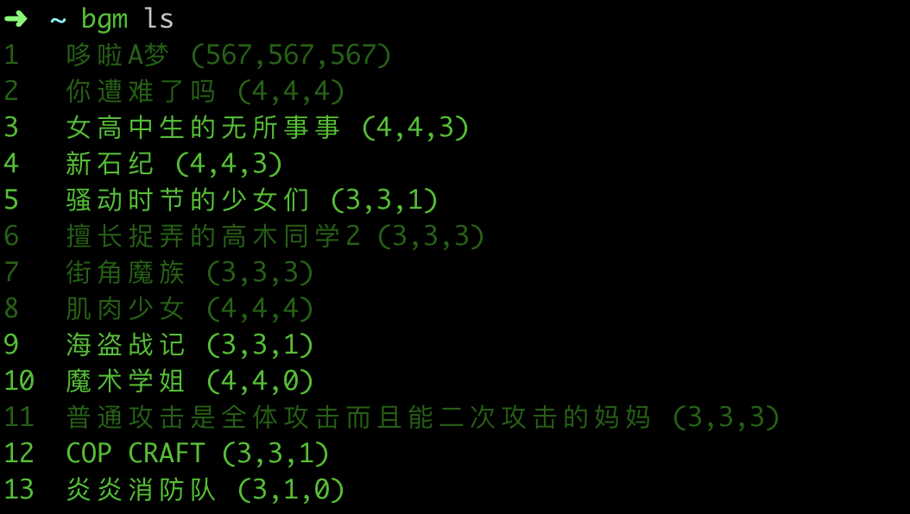

# anisole
一个简单的番剧订阅管理工具。

## 特性
- 数据源：[dmhy](https://share.dmhy.org/)
- 使用 aria2 下载番剧
- 番剧订阅：关键词、过滤、正则
- 最新话、已下载、已观看标记



## 使用

查看可用的命令

```bash
bgm --help
```
### 文件目录

- 工作目录: `user’s home directory` 下的 `.anisole` 文件夹
- 配置文件： 工作目录下的 `anisole.toml` 文件
- 下载目录： 工作目录下的 `bangumi` 文件夹

### 添加订阅

每一个订阅都有以下属性
- `name` : 添加订阅时必须指定的内容, 一般使用番剧名或者简写的番剧名。
- `uid` : 一个正整数，作为唯一的身份标示，也用以快捷地选取番剧订阅。如不特殊指定，则以递增的方式自动生成。
- `keyword`: 实际搜索时真正使用的关键词。如不特殊指定，则使用与 `name` 相同的值。很多时候需要特殊指定，以保证能够搜索到正确的内容。
- `excludes`: 过滤用，排除的关键词。有多个时，采用 `AND` 逻辑过滤。
- `includes`: 过滤用，包含的关键词。有多个时，采用 `OR` 逻辑过滤。
- `prefers`: 排序用。有多个时，每个关键词都会给包含改词的搜索结果给予更高权重。
- `regex`: 过滤用，使用正则表达式过滤结果，优先级高于以上过滤方法。

```bash
$ bgm add 哆啦A梦 -exc "剧场"
$ bgm add 女高中生的无所事事 -k "女高中生 日常"

Add:
12  女高中生的无所事事 (0,0,0)
    --keyword: 女高中生 日常

$ bgm add --help
Usage: bgm add [OPTIONS] [NAMES]...
Options:
  -k, --keyword TEXT     Keyword for searching, default to the name
  -i, --uid INTEGER      Uid of the subscription, auto-generated if not set
  -re, --regex TEXT      Regular expression for matching results
  -inc, --includes TEXT  Includes specific words
  -exc, --excludes TEXT  Excludes specific words
  -p, --prefers TEXT     Prefer specific words
```

### 查看订阅

所有订阅列表
```bash
$ bgm ls
```

查看单个订阅。 `uid` 为 3 的番剧
```bash
$ bgm info 3

3   女高中生的无所事事 (4,4,3)
    --keyword: 女高中生 日常
    --links:
      @1   : 【动漫国字幕组】★07月新番[女高中生的虚度日常][01][1080P][简体][MP4]
      @2   : 【動漫國字幕組】★07月新番[女高中生的虛度日常][02][720P][繁體][MP4]
      @3   : 【DHR百合組】[女高中生的虛度日常_Joshikousei no Mudazukai][03][繁體][720P][MP4]
      @4   : 【喵萌奶茶屋】★7月新番★[女高中生的浪費青春/女高中生的無用日常/女高中生無所事事...
```

括号内的三个数字分别为：最新话、已下载、已观看。当已观看到达最新话时，这个订阅条目就会变暗。

### 更新订阅

更新 `uid` 为 3 的订阅番剧
```bash
$ bgm update 3
```
更新所有
```bash
$ bgm update -a
```
### 下载番剧

下载第四集到 `Aria2`
```bash
$ bgm dl 3 -t 4
```
下载最新一集
```bash
$ bgm dl 3
```

### 播放番剧

播放 `uid` 为 3 的订阅番剧的第四集
```bash
$ bgm play 3 4
```

### 标记番剧
标记 `uid` 为 3 的订阅番剧的第四集为已阅
```bash
$ bgm mark 3 4
```

### 修改配置
```bash
$ bgm config --help
```

直接修改配置文件是更快更方便的选择。

### 删除清空

删除 `uid` 为 3 的订阅
```bash
$ bgm rm 3
```

### 快捷访问

为了简化命令内容，`anisole` 会记住你目前正在操作的番剧订阅。所以在上述命令中，需要填写 `uid` 的命令如果不填写的话，`anisole` 会自动认为你的操作对象是上一次访问过的番剧。

每一次明确在命令中指定了某个番剧订阅的 `uid` 时，`anisole` 都会更新当前操作的对象为该番剧订阅。

## 计划

- Calendar support
- Web interface
- Add more data sources
- Link to bangumi.tv
